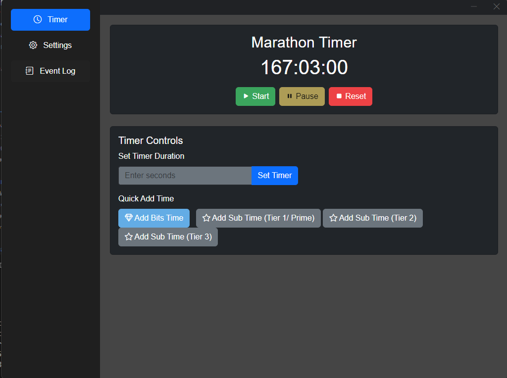

# Twitch Marathon Timer (v0.6.0)

A desktop application that creates an interactive stream timer that automatically extends based on Twitch channel events. Perfect for marathon streams, subathons, or any event where you want to reward viewer engagement with extended stream time.



## Features

- **Dynamic Timer Management**
  - Start, pause, and reset timer
  - Manual time adjustments
  - Persistent timer state across app restarts
  - Real-time updates

- **Twitch Integration**
  - Secure OAuth authentication
  - Automatic token refresh
  - Real-time event tracking via EventSub
  - User profile display

- **Configurable Event Rewards**
  - Bits donations: Customizable minutes per bit
  - Subscription tiers:
    * Tier 1/Prime subscriptions
    * Tier 2 subscriptions
    * Tier 3 subscriptions
  - Gift subscriptions support
  - Resubscription tracking

- **Event Logging**
  - Real-time event tracking
  - Detailed event history
  - Time addition records
  - Clear event log option

## Installation

1. Download the latest [release](https://github.com/DarkWolfie-YouTube/twitch-marathon-timer/releases) for your platform:
   - Windows: `.exe` installer
   - macOS: `.dmg` installer (NOT AVAIABLE YET)

2. Run the installer and follow the setup instructions

3. Launch the application

## Getting Started

1. **First Launch**
   - Navigate to Settings
   - Click "Login with Twitch"
   - Authorize the application
   - Your profile will appear in settings

2. **Configure Timer Settings**
   - Set time rewards for:
     * Bits (minutes per bit)
     * Subscription tiers
   - Save your settings

3. **Start Your Timer**
   - Set initial time (REQUIRED for first use, optional for subsequent uses)
   - Click Start
   - Timer will automatically extend based on events

## Event Types

- **Bits**
  - Each bit adds configured amount of time
  - Example: 1 minute per 1 bit.

- **Subscriptions**
  - Tier 1/Prime: Default 5 minutes
  - Tier 2: Default 10 minutes
  - Tier 3: Default 15 minutes
  - Gift subs count individually

- **Resubscriptions**
  - Counts same as new subscriptions
  - Shows streak in event log

## Development

### Prerequisites
- Node.js (Latest LTS recommended)
- npm or yarn

### Setup
1. Clone the repository
```bash
git clone https://github.com/DarkWolfie-YouTube/twitch-marathon-timer.git
cd twitch-marathon-timer
```

2. Install dependencies
```bash
npm install
```

3. Start Electron Locally
```bash
npm test
```

### Building
```bash
# For All Platforms (Mac Fails on Windows)
npm run build

```

## Security

- Secure token storage
- Encrypted credentials
- Regular token validation
- Automatic token refresh

## Contributing

1. Fork the repository
2. Create your feature branch
3. Commit your changes
4. Push to the branch
5. Create a Pull Request

## License

This project is licensed under the MIT License - see the LICENSE file for details.

## Acknowledgments

- Twitch API Documentation
- Electron Framework
- Bootstrap for UI

## Support

For support, please:
1. Check the [Issues](https://github.com/DarkWolfie-YouTube/twitch-marathon-timer/issues) page
2. Create a new issue if needed
3. Join our Discord community for support and updates

## Contact

- GitHub: [@DarkWolfie-YouTube](https://github.com/DarkWolfie-YouTube)
- Discord: [Server Invite](https://discord.gg.mtUEbB5Qzx)